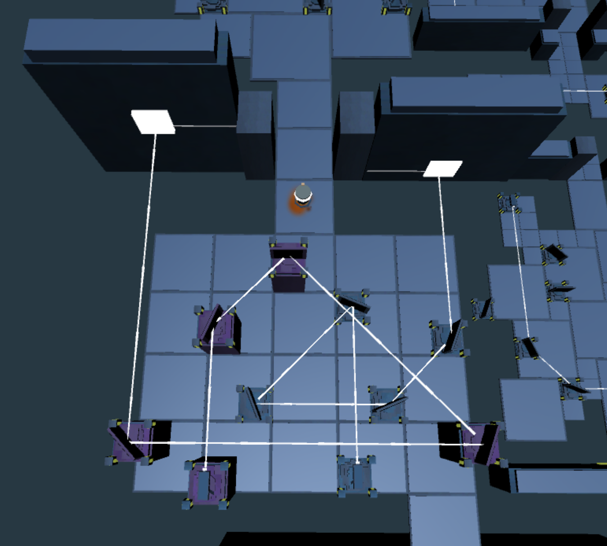

# Game of Enlightening
A mini game of "enlightning", implemented in Unity. Guiding a robot to pass through a maze of light.

### How to play

Simply go to the `Build` folder, choose your platform, and play.

### Screenshots

